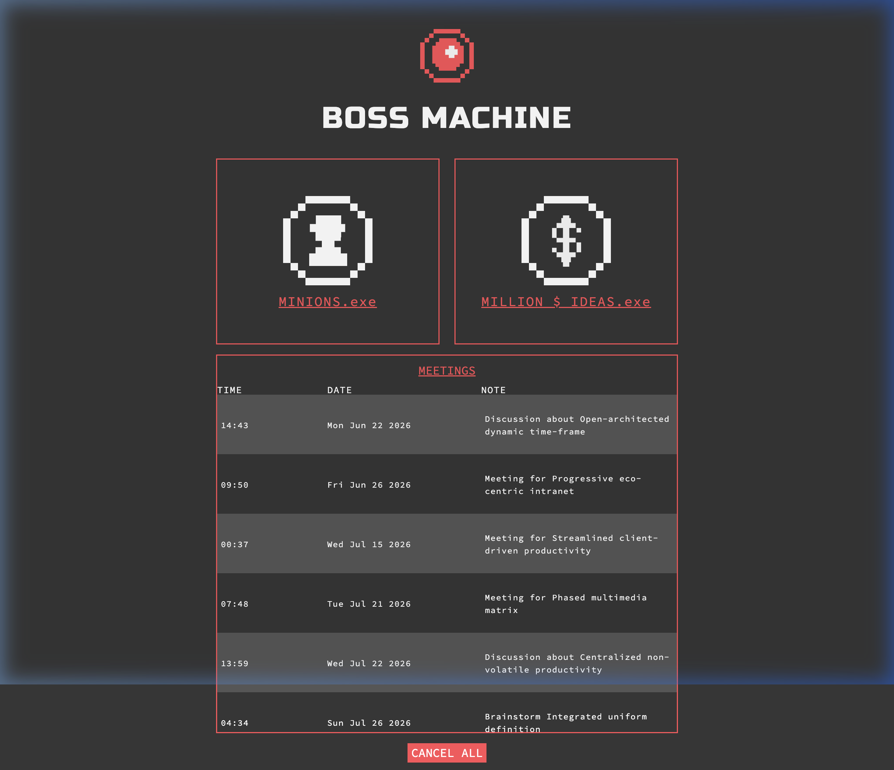
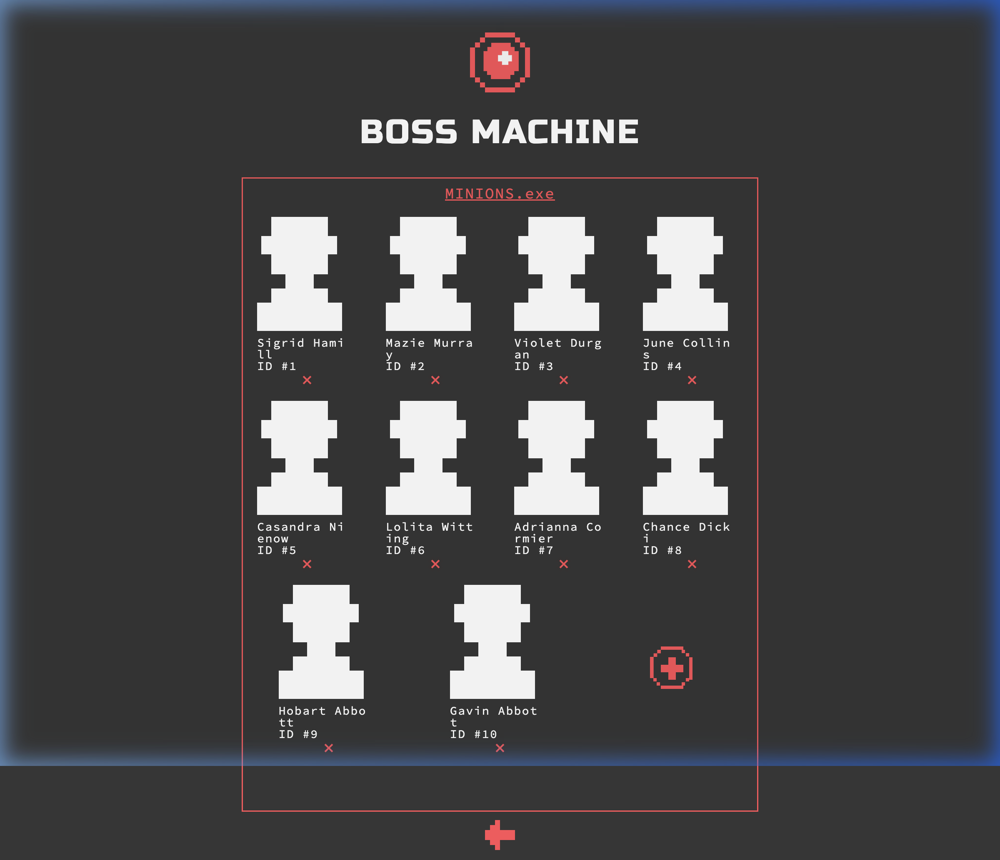

# 🤖 Boss Machine

> A full-stack management application for today's most accomplished (evil) entrepreneurs. Manage your **minions**, brainstorm **million-dollar ideas**, and schedule all those **meetings** — all from one retro-themed dashboard.



---

## 📋 Table of Contents

- [Features](#-features)
- [Screenshots](#-screenshots)
- [Tech Stack](#-tech-stack)
- [Getting Started](#-getting-started)
- [API Reference](#-api-reference)
- [Database Utility](#-database-utility)
- [Custom Middleware](#-custom-middleware)
- [Testing](#-testing)
- [Project Structure](#-project-structure)
- [License](#-license)

---

## ✨ Features

- **Minion Management** — Create, view, edit, and fire (delete) your loyal workforce
- **Million-Dollar Ideas** — Only ideas worth $1,000,000+ make the cut (enforced by custom middleware)
- **Meeting Scheduler** — Auto-generate meetings and nuke your entire calendar when you've had enough
- **Work Delegation** *(Bonus)* — Assign and manage work items for individual minions
- **RESTful API** — Clean, modular Express.js API with proper HTTP status codes and error handling
- **React Frontend** — Retro-themed UI built with React & Redux

---

## 📸 Screenshots

<p align="center">
  
</p>
<p align="center"><em>Home — The Boss Machine command center</em></p>

<p align="center">
  
</p>
<p align="center"><em>Minions — Manage your entire workforce</em></p>

---

## 🛠 Tech Stack

| Layer       | Technology                          |
| ----------- | ----------------------------------- |
| **Runtime** | Node.js                             |
| **Server**  | Express.js                          |
| **Frontend**| React 15, Redux, React Router       |
| **Build**   | Webpack, Babel                      |
| **Testing** | Mocha, Chai, Supertest              |
| **Utility** | cors, body-parser, morgan, nodemon  |

---

## 🚀 Getting Started

### Prerequisites

- **Node.js** (v14+)
- **npm** (v6+)

### Installation

```bash
# Clone the repository
git clone https://github.com/Mahnoor-Zaffar/The_Boss_Machine.git
cd The_Boss_Machine

# Install dependencies (also builds the frontend bundle via postinstall)
npm install
```

### Running the Server

```bash
# Start with auto-restart on file changes (nodemon)
npm run start

# Start with webpack watching + nodemon
npm run start-dev
```

The server will start at **http://localhost:4001**. Open that URL in Chrome (v60+) or Firefox (v55+).

---

## 📡 API Reference

All endpoints are prefixed with `/api`.

### Minions

| Method   | Endpoint                   | Description                     |
| -------- | -------------------------- | ------------------------------- |
| `GET`    | `/api/minions`             | Get all minions                 |
| `POST`   | `/api/minions`             | Create a new minion             |
| `GET`    | `/api/minions/:minionId`   | Get a single minion by ID       |
| `PUT`    | `/api/minions/:minionId`   | Update a single minion by ID    |
| `DELETE` | `/api/minions/:minionId`   | Delete a single minion by ID    |

**Minion Schema:**
```json
{
  "id": "string",
  "name": "string",
  "title": "string",
  "salary": 40000
}
```

### Ideas

| Method   | Endpoint                 | Description                   |
| -------- | ------------------------ | ----------------------------- |
| `GET`    | `/api/ideas`             | Get all ideas                 |
| `POST`   | `/api/ideas`             | Create a new idea *(validated)* |
| `GET`    | `/api/ideas/:ideaId`     | Get a single idea by ID       |
| `PUT`    | `/api/ideas/:ideaId`     | Update a single idea by ID *(validated)* |
| `DELETE` | `/api/ideas/:ideaId`     | Delete a single idea by ID    |

> 💡 POST and PUT requests are validated by the `checkMillionDollarIdea` middleware — only ideas where `numWeeks × weeklyRevenue ≥ $1,000,000` are accepted.

**Idea Schema:**
```json
{
  "id": "string",
  "name": "string",
  "description": "string",
  "numWeeks": 52,
  "weeklyRevenue": 25000
}
```

### Meetings

| Method   | Endpoint           | Description                          |
| -------- | ------------------ | ------------------------------------ |
| `GET`    | `/api/meetings`    | Get all meetings                     |
| `POST`   | `/api/meetings`    | Auto-generate a new meeting          |
| `DELETE` | `/api/meetings`    | Delete **all** meetings              |

> 📌 POST requires no request body — meetings are auto-generated by the server using `createMeeting()`.

**Meeting Schema:**
```json
{
  "time": "14:30",
  "date": "2026-07-15T09:30:00.000Z",
  "day": "Wed Jul 15 2026",
  "note": "Discussion about synergistic paradigms"
}
```

### Work *(Bonus)*

| Method   | Endpoint                                   | Description                          |
| -------- | ------------------------------------------ | ------------------------------------ |
| `GET`    | `/api/minions/:minionId/work`              | Get all work for a specific minion   |
| `POST`   | `/api/minions/:minionId/work`              | Create a work item for a minion      |
| `PUT`    | `/api/minions/:minionId/work/:workId`      | Update a work item by ID             |
| `DELETE` | `/api/minions/:minionId/work/:workId`      | Delete a work item by ID             |

**Work Schema:**
```json
{
  "id": "string",
  "title": "string",
  "description": "string",
  "hours": 8,
  "minionId": "string"
}
```

---

## 🗄 Database Utility

The in-memory database (`server/db.js`) is re-seeded on every server restart. It exports the following helpers:

| Function                       | Description                                              |
| ------------------------------ | -------------------------------------------------------- |
| `getAllFromDatabase(model)`     | Returns all entries for the given model                  |
| `getFromDatabaseById(model, id)` | Returns a single entry by ID, or `null`               |
| `addToDatabase(model, instance)` | Adds a new entry (auto-assigns `id`), returns it       |
| `updateInstanceInDatabase(model, instance)` | Updates an existing entry by `id`, returns it |
| `deleteFromDatabasebyId(model, id)` | Deletes by ID; returns `true` or `false`           |
| `deleteAllFromDatabase(model)` | Wipes all entries for the model                          |
| `createMeeting()`             | Generates a random meeting object                         |

Valid model names: `'minions'`, `'ideas'`, `'meetings'`, `'work'`

---

## 🛡 Custom Middleware

### `checkMillionDollarIdea`

Located in `server/checkMillionDollarIdea.js`, this middleware guards the Ideas POST and PUT routes.

**Logic:**
1. Extracts `numWeeks` and `weeklyRevenue` from `req.body`
2. Coerces both values from String → Number
3. If the product is **≥ 1,000,000** → calls `next()`
4. Otherwise → responds with **400 Bad Request**

---

## 🧪 Testing

```bash
# Run the full test suite (43 tests)
npm run test
```

All core tests cover:
- CRUD operations for Minions, Ideas, and Meetings
- Proper HTTP status codes (200, 201, 204, 400, 404)
- `checkMillionDollarIdea` middleware validation
- Database persistence and edge cases

### Bonus Tests

To activate the Work route tests, edit `test/test.js` line ~689:

```diff
- xdescribe('BONUS: /api/minions/:minionId/work routes', ...
+ describe('BONUS: /api/minions/:minionId/work routes', ...
```

---

## 📁 Project Structure

```
boss-machine/
├── app.js                          # Express app setup (middleware, routing)
├── main.js                         # Server entry point (port binding)
├── index.html                      # Frontend SPA entry
├── package.json
├── webpack.config.js
│
├── server/
│   ├── api.js                      # Root API router — mounts all sub-routers
│   ├── minions.js                  # /api/minions routes
│   ├── ideas.js                    # /api/ideas routes
│   ├── meetings.js                 # /api/meetings routes
│   ├── work.js                     # /api/minions/:minionId/work routes (bonus)
│   ├── checkMillionDollarIdea.js   # Custom validation middleware
│   └── db.js                       # In-memory database + helper functions
│
├── browser/                        # React frontend source (do not modify)
│   ├── index.js
│   ├── components/
│   └── store/
│
├── public/                         # Static assets (CSS, images, JS bundle)
│   ├── css/
│   ├── img/
│   └── js/
│
├── screenshots/                    # App screenshots for README
│
└── test/
    └── test.js                     # Mocha test suite (43 core + 18 bonus tests)
```

---

## 📄 License

This project is licensed under the ISC License.

---

<p align="center">
  <em>Built with ☕ and a healthy dose of megalomania.</em>
</p>